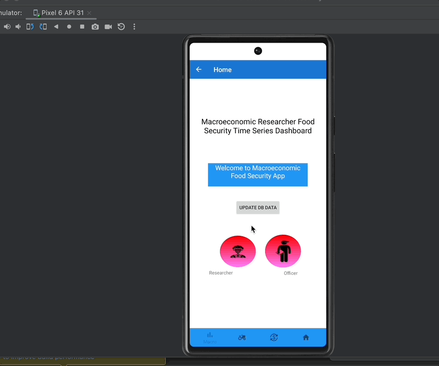
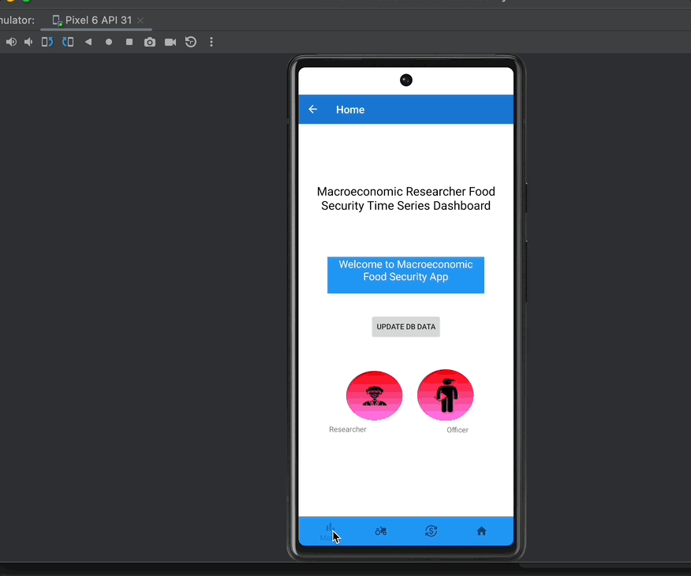
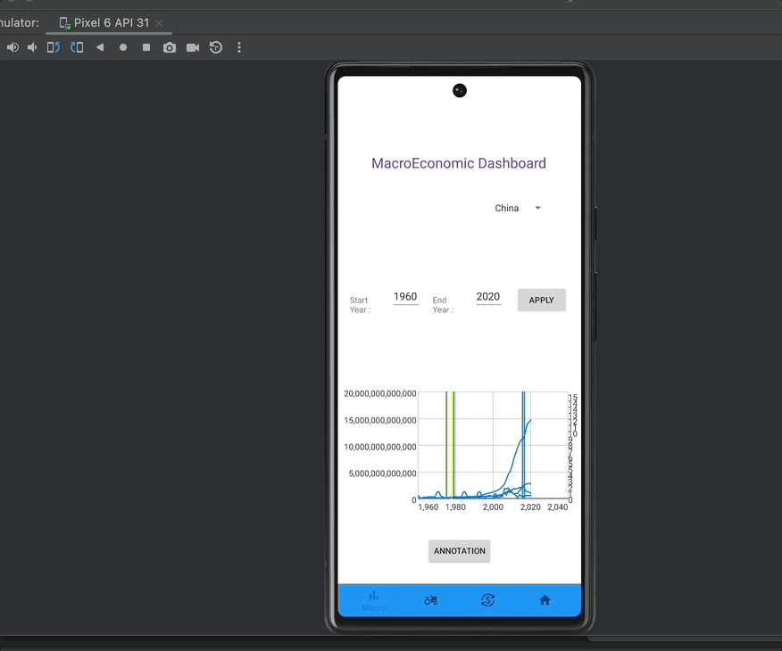
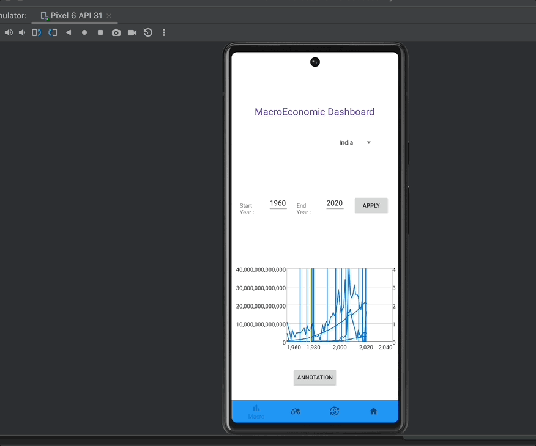
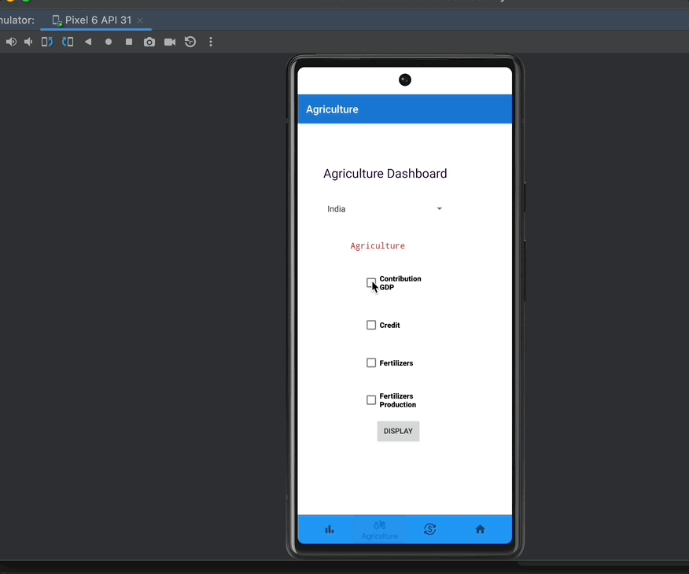
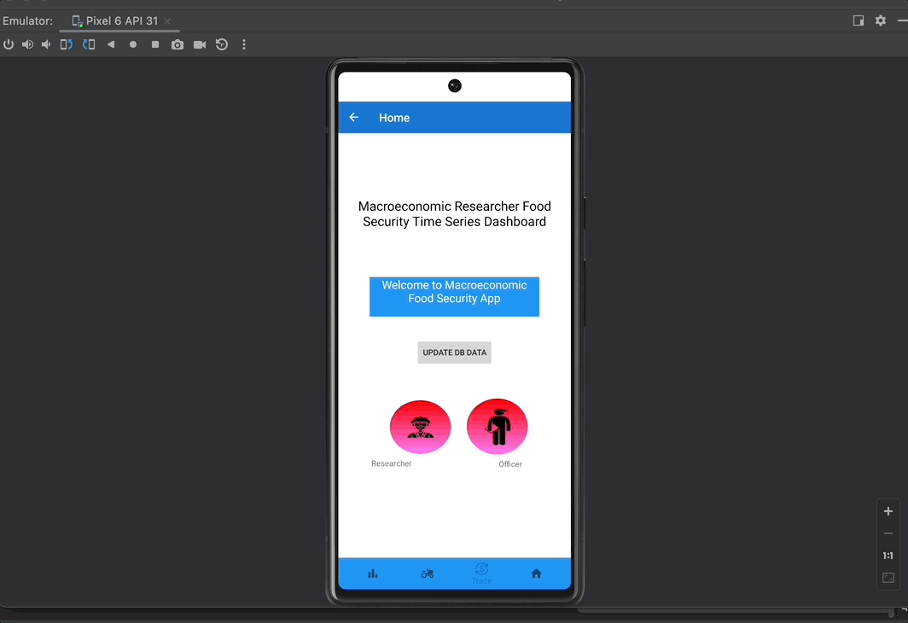

# CMPE 277 Hackathon- Macro Economic And Food Security App

# Introduction

### Team Name: Code Builders 
### Team Members:  
Bhavya Hegde - 016656029 
Darshini Venkatesha Murthy Nag - 016668951 
Sirisha Polisetty - 016012477 

# Application Requirement

* Country selector 
* Should be able to render time series
* Support Network and Local Mode
* Menu Select
* Annotation Support

